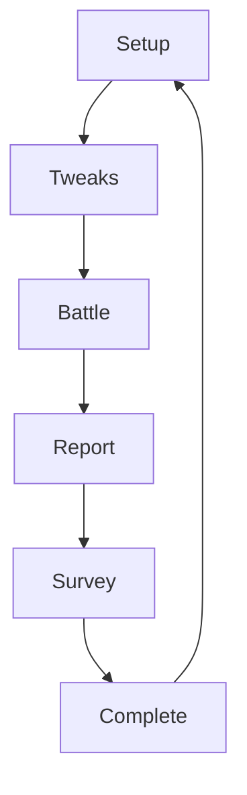
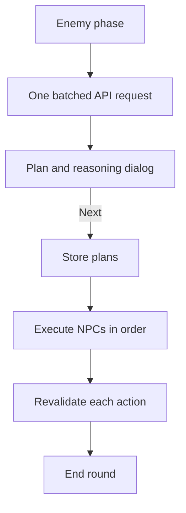

# Combat Solo Tester — Developer Specification

This document explains the current implementation of the Combat Rules V0 solo test rig. It is intended for developers and coding agents extending the app. For player-facing usage, see [README.md](README.md). For the rules the engine is meant to implement, see [COMBAT_RULES_V0.md](../../docs/COMBAT_RULES_V0.md) and [COMBAT_PLAYTEST_PACKET_V0.md](../../docs/COMBAT_PLAYTEST_PACKET_V0.md).

## 1. Purpose and boundaries

The app is a dependency-free browser test harness for two combat encounters. It has three simultaneous responsibilities:

1. Enforce the coded combat rules and programmed GM rulings.
2. Let a human, a deterministic doctrine, or the ChatGPT API control actors.
3. Record objective evidence and a subjective debrief for later rules analysis.

The tweak screen may deliberately create configurations that are not legal under the tabletop rules. Once combat starts, however, every action must still obey the configured AP, resource, range, target, condition, and reaction rules.

The app is not a general virtual tabletop, character builder, campaign manager, or authoritative replacement for the written rules. Where the written rules leave a decision to the GM, the app uses the published deterministic doctrine or the selected AI behavior.

The written rules' Critical Round subsystem is a known implementation gap. The current app incorporates the revised default DEF values but does not schedule, spend, or record Criticals. Do not silently approximate Critical behavior inside an existing action path; add it through an explicit interaction and automation design.

## 2. Runtime constraints

- The app must continue to work by opening `index.html` directly through `file://`.
- There is no package manager, bundler, framework, module loader, server, or build step.
- Manual and deterministic modes must work offline.
- ChatGPT API control is the only feature that requires network access.
- Runtime state must be serializable as JSON. Do not put functions, DOM nodes, promises, class instances, circular references, or API credentials into `state`.
- Browser local storage is the persistence layer.
- There is deliberately no undo.

These constraints are architectural requirements, not temporary shortcuts.

## 3. File map and load order

| File | Responsibility |
|---|---|
| `index.html` | Static shell, stylesheet order, script order, app and modal roots. |
| `styles.css` | Core layout, battle UI, forms, cards, map, log, reports, and print styling. |
| `policy-controls.css` | Deterministic doctrine and NPC defense-policy controls. |
| `ai-controls.css` | ChatGPT API settings, behavior controls, decision records, and AI dialogs. |
| `app.js` | Templates, state, screens, manual actions, deterministic doctrines, combat resolution, encounter flow, metrics, survey, and rendering. |
| `ai-controller.js` | API settings, behavior presets, legal-choice construction, API requests, PC action segments, batched NPC plans, AI reactions, retries, and AI telemetry. |
| `tests/combat-engine.test.js` | Node/VM integration tests with a minimal fake DOM and mocked API. |

`ai-controller.js` is loaded before `app.js`. Both files are classic scripts sharing the same global scope. Functions in `ai-controller.js` may refer to functions declared later by `app.js`, provided those references are not evaluated until both scripts have loaded.

Do not casually reverse the script order, add `type="module"`, or introduce top-level names that collide between the two files.

## 4. High-level state machine

The top-level `state.screen` controls rendering:



The corresponding render functions are:

| `state.screen` | Renderer |
|---|---|
| `setup` | `setupView()` |
| `tweaks` | `tweakView()` |
| `battle` | `battleView()` |
| `report` | `reportView()` |
| `survey` | `surveyView()` |
| `complete` | `completeView()` |

`render()` replaces the current application markup. Event listeners therefore do not survive a render and must be rebound by the screen renderer, such as `bindBattle()` or `bindAISettings()`.

Use these state helpers consistently:

- `save()` persists without rendering.
- `commit()` persists and then renders.
- `log()` appends a timestamped combat event and persists.
- `showModal()` and `closeModal()` manage the shared modal root.

Avoid calling `commit()` in the middle of a callback chain unless the next callback is still guaranteed to run. Rendering does not cancel JavaScript execution, but it replaces controls and can make a paused interaction unreachable if the continuation is lost.

## 5. Persistent state

The active save uses the `SAVE_KEY` constant in `app.js`. The API key and model ID use separate keys in `ai-controller.js`.

The top-level state has this conceptual shape:

```text
state
├── screen
├── mode
├── tweaks
├── battle
├── results
├── survey
└── autoPause
```

Important fields in `state.battle` include:

| Field | Meaning |
|---|---|
| `key`, `name` | Encounter identity. |
| `zones`, `links` | Weighted zone graph. Zone locations are numeric indices. |
| `round`, `phase` | Current round and `pc`/`enemy` phase. |
| `pcs`, `enemies` | Mutable actor records cloned from configured templates. |
| `selected` | Currently selected PC ID. |
| `enemyIndex` | Current index in the living-enemy execution list. |
| `aiEnemyPlans` | Accepted batched NPC plans for the current enemy phase only. |
| `log` | Ordered player-facing event records. |
| `metrics` | Objective counters, including nested AI usage metrics. |
| `aiDecisions` | Sanitized AI decision evidence. |
| `abilityUses` | Per-character ability-use counts. |
| `rounds` | End-of-round summaries. |
| `started` | Encounter start timestamp. |

The app clones templates through JSON serialization. Function-valued template fields will be silently lost and must never be used. Store formulas as data and calculate them in named functions.

If a change makes old saves unsafe or structurally incompatible, increment `SAVE_KEY`. Do not attempt to resume an in-flight callback, pending modal, promise, or API request after reload. Persist durable state and reconstruct the next interaction from it.

The API key must remain outside `state`. It must never appear in combat saves, prompts, logs, results, tests, or exported/printed reports.

## 6. Configuration model

`defaultTweaks()` is the canonical setup schema. It contains:

- Per-PC statistics, control mode, and AI behavior.
- Per-encounter enemy archetype statistics, count, control mode, AI behavior, and defense policy.
- The troll Boss Edge toggle.
- A nullable applied-placement snapshot for each encounter.

PC control values are:

| Value | Controller |
|---|---|
| `manual` | Human through the normal action UI. |
| `allout` | Deterministic All-Out Attacker doctrine. |
| `prepared` | Deterministic Always Prepared doctrine. |
| `survivor` | Deterministic Reactive Survivor doctrine. |
| `ai` | ChatGPT API behavior selected per PC. |

NPC control is assigned per archetype. `rigid` uses the coded GM doctrine and `ai` uses the selected API behavior.

`makeConfiguredEnemies()` materializes individual enemies from an archetype configuration. Any new tweak field that affects combat must be copied into the runtime actor here or handled explicitly when the encounter starts.

### 6.1 Unit placement

Placement is configured before an encounter and stored under `tweaks.placements[encounterKey]`. An applied snapshot contains:

- One zone index for every fixed PC ID.
- One zone index for every concrete enemy ID generated by the configured archetype counts.
- The enemy archetype counts that existed when the placement was applied.

`defaultPlacement()` derives a draft from the encounter's published PC start zone and enemy template zones. The modal edits a deep-cloned draft. Drag-and-drop and the select-unit/select-zone fallback both call `movePlacementUnit()`, which only changes that draft. **Cancel** closes the modal without changing setup state. `applyPlacement()` validates the complete PC and enemy ID sets plus every zone index before storing the snapshot.

Once a placement is applied, enemy count inputs are disabled because changing a count would invalidate the concrete unit IDs in the snapshot. `resetPlacement()` discards the snapshot and unlocks those inputs. Resetting all published tweak values also creates fresh nullable placement state. Other enemy statistics remain editable while counts are locked.

## 7. Spatial model

Each encounter defines:

- `zones`: display names indexed from zero.
- `links`: tuples of `[zoneA, zoneB, apCost]`.
- `start`: the PCs' starting zone.

Without an applied placement, PCs use `start` and enemies use their template zones. With an applied placement, `startEncounter()` and `makeConfiguredEnemies()` copy the saved zone indices into the runtime actors. Placement does not spend AP, produce combat log entries, or restrict either side to particular zones.

`distance(a, b)` returns the cheapest weighted distance through the graph. `adjacent(zone)` returns directly connected zones and their individual costs.

Never assume every connection costs 1 AP. The Bandit Camp Watchtower connection costs 2 AP, and an earlier implementation entered an infinite loop because movement logic ignored that fact.

Action legality, AI option construction, movement execution, range display, and deterministic pathfinding must all use the same graph helpers.

## 8. Combat lifecycle

### 8.1 Encounter start

`startEncounter(key)`:

1. Verifies that an API key exists if any configured actor uses AI control.
2. Clones and applies PC tweaks, including any applied PC placement.
3. Creates configured enemies, including any applied enemy placement.
4. Initializes logs, metrics, resources, conditions, and encounter flags.
5. Initializes troll Boss Edges when enabled.
6. Logs encounter-specific information.
7. Enters the first PC phase.

PCs act first unless a future encounter explicitly implements a different rule.

### 8.2 PC phase

The player chooses the order of manual and AI-controlled PCs. Deterministic doctrine PCs are selected and run automatically by `continuePCPhase()`.

`finalizePCTurn()` marks a PC as acted, records retained AP, and captures doctrine-turn summaries. `advanceAfterPCTurn()` either continues the PC phase or starts the enemy phase. In the troll encounter, Boss Edges resolve between completed PC turns and the next normal phase step.

### 8.3 Enemy phase

`enemyPhase()` resets enemy-phase targeting counters and calls `prepareAIEnemyPhase(processEnemy)`.

- If there are no AI enemies, execution begins immediately.
- If there are AI enemies, one API request plans all their normal turns. Execution waits behind the plan's **Next** button.
- `processEnemy()` walks living enemies in encounter order.
- Rigid bandits use `runBanditStep()`.
- Rigid trolls use `runTrollNormal()`.
- AI enemies use `runAINPCPlan()`.

Every asynchronous or modal combat operation receives a continuation callback. It must call that callback exactly once. Missing it freezes the phase; calling it twice skips actors or duplicates actions.

### 8.4 Round end

`endRound()` records expired AP and the round summary, increments the round, refreshes AP, transfers attack-frequency history, clears prepared actions, refreshes enabled Boss Edges, and returns to the PC phase.

## 9. Action resolution

The rules engine—not the UI, deterministic doctrine, or model—is authoritative.

### 9.1 Standard pattern

An action implementation should follow this order:

1. Enumerate or receive a legal action.
2. Revalidate it immediately before execution.
3. Pay AP and other resources exactly once.
4. Resolve reactions or prepared actions in callback order.
5. Roll only where the rules require it.
6. Apply damage, healing, movement, or conditions.
7. Record metrics and player-facing log entries.
8. Check victory or continue the current actor's turn.

Be careful where AP is deducted. For example, `enemySingle()` owns the normal single-target attack AP deduction, while `executeAINPCOption()` deducts AP itself for movement, Rally, and multi-target attacks. Moving a deduction between layers can easily charge twice.

### 9.2 PC attacks and NPC defense

`resolvePCAttack()` handles PC attacks against one or more enemies. NPC defense is selected locally:

- Rigid enemies use `enemyShouldDefend()` and the tweak-screen defense policy.
- AI-controlled enemies use `aiNPCShouldDefend()` and their behavior preset.

Defending spends NPC AP. A single-target defense rolls percentile and logs both the roll and target number. A multi-target defense applies DEF automatically without a roll.

### 9.3 Enemy attacks and PC reactions

`enemySingle()` and `enemyMulti()` lead into `reactionPrompt()`.

Reaction priority is:

1. AI preset reaction policy, including AI Protect choices.
2. Deterministic PC doctrine reaction policy.
3. Human reaction prompt for remaining manual choices.

Defend and Protect never call the API. This is intentional for cost, latency, reproducibility, and avoidance of nested call loops.

`resolveEnemyHit()` owns interception, reaction resource costs, defense rolls, damage, conditions, unconsciousness, and the manual Sera Riposte prompt.

### 9.4 Conditions

Conditions are string values in each actor's `conditions` array. Current special handling includes:

- `Incapacitated`: restricts legal actions and reduces available AP; Concussive Blow applies it on damaging resolution.
- `Persistent Damage`: suppresses troll Regeneration until recovered. It does not deal its ordinary damage in this encounter.

Condition application and removal must be logged and must not create duplicate array entries.

### 9.5 Boss Edges

Boss Edges are separate off-turn troll actions, not part of the batched normal enemy phase. They may occur after each PC turn, consume one Edge, and refresh at round start when enabled.

AI-controlled Boss Edges currently use their own API decision. Rigid Boss Edges use `trollEdgeOneRigid()`.

## 10. Deterministic PC doctrines

Deterministic doctrines live primarily in `app.js`. They are not prompts and must produce the same decision from the same state.

- **All-Out Attacker** spends offensively, does not retain reaction AP, and does not Defend or Protect.
- **Always Prepared** reserves reaction AP, heals endangered allies, and uses defensive reactions.
- **Reactive Survivor** reserves and reacts only after visible danger thresholds are met.

Doctrine turns pause after completion through `state.autoPause`. The summary is generated from the turn's log slice. The **Next** button clears the pause and resumes combat.

When changing a doctrine, update both its turn policy and its reaction policy. Add tests for resource reservation, movement, target selection, healing/revival, and reaction behavior independently.

## 11. ChatGPT API controller

### 11.1 Trust boundary

The model is a chooser, never the rules engine. It receives only enumerated legal IDs and brief state context. Structured output constrains the response, and JavaScript revalidates the selected choice before execution.

Never execute model-authored JavaScript, parse model prose as rules, accept invented IDs, or let the model directly mutate `state`.

Requests use the Responses API with `store: false`. `requestAIDecision()` retries up to `AI_MAX_ATTEMPTS` and records every attempt's latency and reported token usage. After failure, the user is offered the applicable combination of retry, manual control, deterministic fallback, or ending the turn.

### 11.2 Information disclosure

PC AI receives opponents through `visibleEnemySnapshot()`, which exposes qualitative health and visible position rather than exact hidden enemy statistics. NPC AI receives full PC information because it acts as the GM side.

Keep this distinction when adding prompt fields. Do not accidentally reveal exact NPC HP, Dodge, Threat, or other hidden values to PC AI.

### 11.3 PC action segments

AI PCs remain under player-controlled turn order. Selecting one exposes **Start AI turn**.

`legalAIPCSegments()` enumerates legal action sequences from the PC's current state. A segment may contain deterministic setup actions followed by the first uncertain action. Examples:

- Move → attack
- Use supplies → move → attack
- Move → heal → end turn
- Recover condition → attack
- End turn

An attack is currently the uncertainty boundary because defense, rolls, damage, conditions, or defeat may change the best next decision. The boundary action is included in the segment. After it resolves, the app requests a new segment only if the PC is still active and has AP remaining. A zero-AP PC ends automatically without another API call.

Segment generation temporarily mutates actor data to simulate deterministic actions, then restores it. Simulation functions must not log, save, render, increment metrics, roll dice, trigger reactions, or call normal execution functions with side effects.

Every returned segment must be executable from the state in which it was generated. `executeAIPCSegment()` still revalidates each step because callbacks and prepared effects can alter state.

### 11.4 Batched NPC normal turns

`legalAINPCTurnPlans()` enumerates complete AP-legal turn sequences from each AI NPC's actual starting state. The API receives all AI actors and selects one supplied sequence per actor in a single request.

Important properties:

- Plans are generated from actual positions, AP, resources, and conditions—not a union of actions possible from arbitrary zones.
- The response must contain exactly one plan for each AI NPC.
- Each returned action sequence must exactly match a supplied legal sequence.
- Plans are capped and ordered to keep prompts bounded.
- Plans are stored temporarily in `state.battle.aiEnemyPlans` after the player presses **Next**.
- `runAINPCPlan()` revalidates every action during execution.
- If an earlier NPC makes a target or action stale, `repairAINPCAction()` selects a local equivalent legal action instead of making another API call or forfeiting the whole turn.
- Stored plans are deleted at the end of the enemy phase.

The end-to-end path is:



Tests must exercise this entire path. Merely asserting that plans were returned or stored is insufficient; a previous undeclared-variable bug occurred only after **Next**, before the first action executed.

### 11.5 Local AI reaction presets

`aiNPCShouldDefend()` decides NPC defense spending. `aiPresetReaction()` and `aiProtectorChoice()` decide PC Defend, Galeshield, Protect, and Shielded Intercession behavior.

These are deterministic JavaScript policies associated with the selected AI behavior label. They must not call the API. If a behavior preset changes, update its local reaction policy and corresponding tests as well as its prompt description.

### 11.6 API telemetry

The app records:

- Behavior preset.
- Chosen action or sequence.
- Short model reasoning.
- Retry count.
- Aggregate latency.
- Input, output, and total token usage reported by the API.
- Round, phase, actor, and model ID.

Raw prompts, raw responses, and the API key are not retained.

## 12. Metrics and reports

Metrics are initialized in `startEncounter()`. If a feature adds an objectively measurable playtest question, initialize its counter there, increment it at the authoritative resolution point, and display it in the relevant report.

Do not infer objective metrics later by scraping log prose. Logs are player-facing and may be reworded; metrics are structured evidence.

`finishEncounter()` copies the completed encounter into `state.results`. Each encounter has its own report and then proceeds directly to the survey.

The subjective survey should contain only information the engine cannot reliably infer, such as uncertainty, remembered decisions, and player expectations.

## 13. Rendering and dialogs

The UI is rendered with template strings. Escape any API- or user-controlled text with `escapeAIHtml()` before inserting it into HTML.

Dialogs are part of combat sequencing, not decorative overlays. A dialog that awaits user input owns a continuation. Closing or replacing it without invoking the intended continuation can strand combat.

When adding a new pause:

1. Define what durable state represents the pause.
2. Ensure refresh cannot resume halfway through an unpersistable function call.
3. Give the user a clear next action.
4. Test the button handler, not just the rendered text.

## 14. Testing strategy

Run from `apps/combat-solo-tester`:

```bash
node --check app.js
node --check ai-controller.js
node --check tests/combat-engine.test.js
node tests/combat-engine.test.js
```

The test harness loads both scripts into a Node `vm` context with:

- A minimal fake DOM.
- In-memory local storage.
- Mocked `fetch` for API tests.
- No live API calls or token usage.

Tests should assert state changes and sequencing, not only HTML strings. For callback- or modal-driven features, exercise the user action that continues execution.

Minimum regression coverage for combat-flow changes:

- Legal option enumeration.
- AP and resource spending.
- Range and weighted movement.
- Resulting HP, conditions, and position.
- Log entry.
- Continuation to the next actor or round.
- API request count where AI is involved.
- Failure or stale-plan behavior.

Use `git diff --check` in addition to the JavaScript checks.

## 15. Extension recipes

### Add a PC ability

1. Add data to the appropriate `PC_TEMPLATES` ability list.
2. Reuse an existing ability `type` or implement its manual targeting and resolution.
3. Teach `legalAIPCOptions()` how to enumerate every legal target form.
4. Teach `executeAIPCOption()` how to execute it.
5. Decide whether it is an AI uncertainty boundary.
6. Update deterministic doctrines if they should use it specially.
7. Add legality, payment, resolution, and AI tests.

### Add an enemy ability or archetype

1. Add the enemy template and tweak defaults.
2. Add rigid-GM selection and execution.
3. Add legal AI option enumeration and execution.
4. Define AP ownership at exactly one layer.
5. Add reaction and condition handling.
6. Test both rigid and AI-controlled execution through a complete enemy phase.

### Add a condition

1. Define its exact string and avoid aliases.
2. Define application, duplicate handling, and removal.
3. Apply its restrictions in every legality generator.
4. Apply its start/end-of-turn effects at one authoritative lifecycle point.
5. Include it in AI snapshots if it affects decisions.
6. Add log, state, recovery, and persistence tests.

### Add an encounter

1. Add zones, weighted links, start zone, and enemy templates to `ENCOUNTERS`.
2. Add tweak defaults and setup rendering.
3. Add setup-mode selection and verify the generated default placement.
4. Add encounter-specific information and mechanics.
5. Ensure manual, deterministic, mixed, and AI-only configurations can complete.
6. Add repeated-round progress tests to detect no-progress loops.

## 16. Non-negotiable invariants

Future changes must preserve these properties:

1. The engine validates legality; controllers only choose among legal options.
2. AP and other resources are never spent more than once per action.
3. Every combat continuation fires exactly once.
4. Weighted zone connections are respected everywhere.
5. Defend and Protect policies do not call the API.
6. AI NPC normal turns use one batched request per enemy phase.
7. AI PC calls stop at uncertainty boundaries and do not spend calls on deterministic intermediate steps.
8. Model output is revalidated immediately before execution.
9. A stale batched plan adapts locally or fails visibly; it never silently freezes combat.
10. Every action, explicit end, or no-AP turn produces understandable log evidence.
11. Saved state remains JSON-only and contains no API credential.
12. PC AI receives no hidden enemy statistics.
13. Manual and deterministic modes remain usable from `file://` without network access.
14. Tests cover execution after **Next**, not only planning before it.

When an implementation choice conflicts with one of these invariants, change the design explicitly and document the reason rather than weakening the invariant accidentally.
